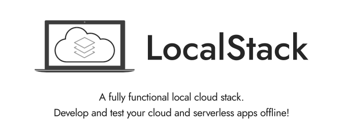
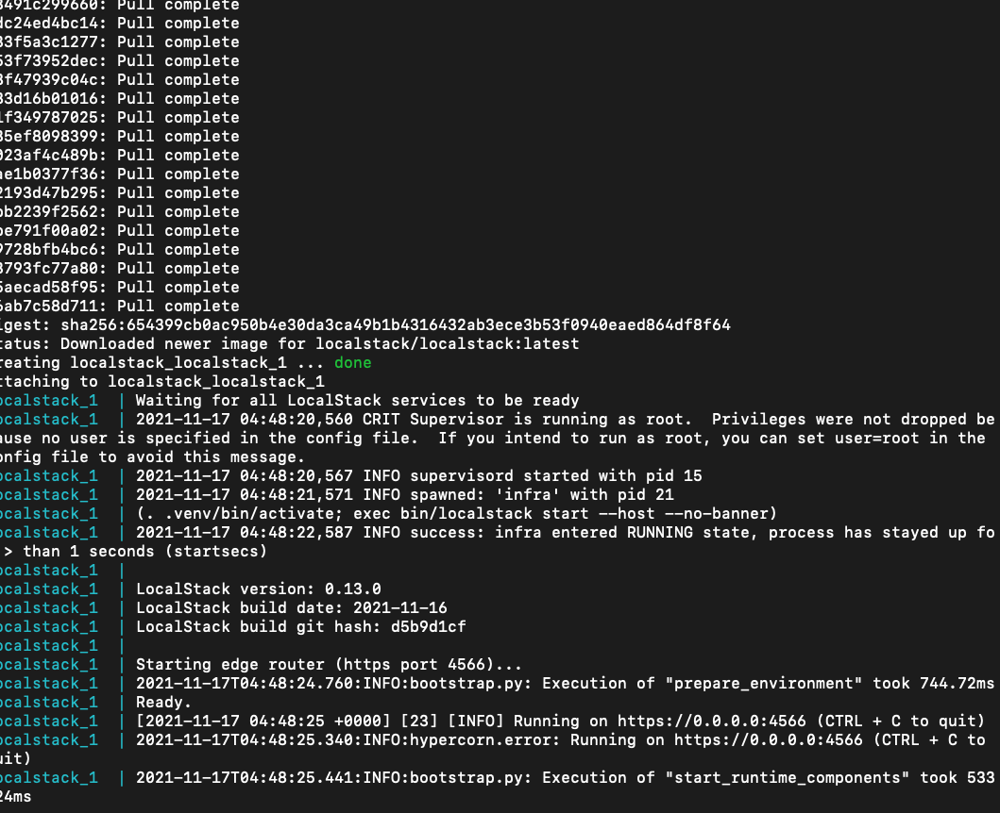
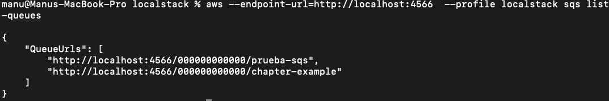

# Chapter Backend Engineering - LocalStack



**¿Qué es localstack?**

LocalStack es un proyecto open-source que se esfuerza por crear las implementaciones locales de distintos servicios de la Nube, enfocándose principalmente en AWS.

Por mencionar un ejemplo, **el comando `aws sqs --create-queue`nos servirá exactamente igual** a como si habláramos con AWS. Nos entregará las mismas respuestas y creará el mismo comportamiento, **solo que está vez será tu equipo quien ejecute TODO.**

## **¿Qué servicios hacen parte de LocalStack?**

Si bien **la lista de servicios que se han agregados a localstack crece día a día**, hoy podemos contar con servicios de Notificaciones*(SNS)*, Computo *(Lambda, Step Functions)*, Base de datos *(DynamoDB),* Monitoreo *(CloudWatch)*, Manejo de Emails *(SES)*, BigData *(Athena, RedShift, Kinesis)* y estos son solo algunos de los ejemplos.

> Revisa todos los servicios disponibles en la documentación de LocalStack https://github.com/localstack/localstack
> 

### ¿Por qué utilizar LocalStack?

1. Ejecutar nuestras aplicaciones sin conectarse a AWS.
2. Evitar la complejidad de la configuración de AWS y centrarse en el desarrollo.
3. Ejecución de pruebas en nuestra canalización de CI / CD.
4. Configurar y probar escenarios de error.

Una vez que todas las pruebas son ecológicas, la aplicación se puede implementar sin problemas en el entorno real de la nube de AWS.


## Beneficios de usar LocalStack

- Reducir el costo
- Pruebe los recursos de la nube de AWS de forma local
- Obtenga información sobre los recursos en la nube de AWS a nivel local
- Depurar localmente

**¿Cómo usarlos?**

Hay varias formas de conectarse a los servicios de AWS en la nube, una de ellas es **la Línea de comandos, será nuestra forma de comunicarnos con los servicio de LocalStack** en nuestro equipo.

Puedes instalar LocalStack usando Python con PIP o Instanciar una imagen de Localstack con Docker. **Para mi, la forma más fácil es usar Docker para levantar el servicio** y es así como te mostraré en los ejemplos.

Para iniciar, tengamos instalado en nuestro equipo lo siguiente:

- [Command Line Interface *(CLI)* de AWS](https://aws.amazon.com/es/cli/)
- Docker
- Docker-compose

## **📁Docker Compose File**

Usaremos docker-compose para levantar fácilmente nuestros servicios ejecutando el .yml a continuación con 

`$ docker-compose up --build` 


*Nota: en las variables de entorno, **agregamos los servicios queremos que sean inicializados en tu equipo, separados por coma.***

La terminal debe iniciar el proceso de descarga de la imagen de localstack y posteriormente la pondrá en ejecución:



Por último **necesitamos configurar nuestro AWS CLI para que use nuevas credenciales.**

> Usando aws configure --profile localstack
> 

```bash
AWS Access Key ID [None]: test
AWS Secret Access Key [None]: test
Default region name [None]: us-east-1
Default output format [None]: json
```

Para verificar si SQS está disponible podemos verificar que el puerto 4576 esté disponible, para ello podemos ejecutar el comando:

```bash
nc -zv 127.0.0.1 4576
```

También puedes hacer uso de Portainer para ver que esté en ejecución. 


### **🎉¡Vamos a hacerlo!**

Ahora sí, empecemos a crear servicios en LocalStack. **Usaremos la misma app de CLI de amazon pero estableciéndole la ruta a donde se comunicará.**

`aws --endpoint [http://localhost:4566](http://localhost:4566/) --profile localstack` 

*El endpoint por defecto es AWS, esta vez lo será un puerto de nuestro equipo.*

### **Creando una SQS y enviando un mensaje**

*Puedes encontrar más información para interactuar con la CLI de AWS en su documentación: [https://docs.aws.amazon.com/cli/latest/reference](https://docs.aws.amazon.com/cli/latest/reference/)*

*Comando para crear una SQS*


La respuesta que nos entrega es la URL de la nueva SQS tal como si la creáramos en la nube de Amazon, pero esta vez está apuntando a tu localhost en el puerto 4566.


### Lista de cola SQS

Para verificar todas las colas creadas en el LocalStack, escriba el siguiente comando en la terminal




### **Sigamos, enviemos un mensaje!**


### **Leyendo los mensajes de la queue en LocalStack**

Ahora, deberíamos poder revisar los mensajes que están siendo guardados en la SQS que se ejecuta localmente:


### Eliminar cola de SQS

Para eliminar, la cola de SQS. Escriba el siguiente comando en la terminal.


### Ejemplos


Manos a la obra revisemos una basica implementacion en nodejs la cual esta en el folder examples.
